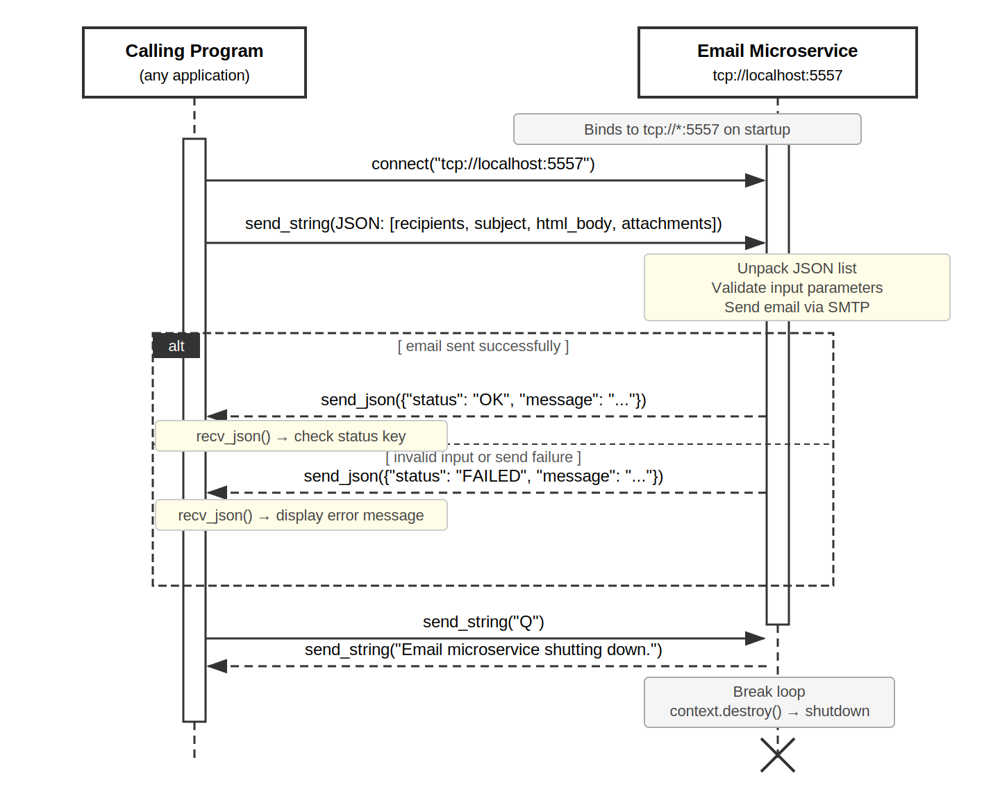

# Email Sending Microservice

## Function:

This microservice allows the calling program to send emails to one or more recipients with an HTML formatted body and optional CSV attachments.

The service provides:
- Automatic parsing of JSON attachments into a CSV file, where the keys are the headers and the values are the rows.
- Input validation and helpful error responses to the calling program in case of bad input.
- Error responses if the SMTP server failed to log in or if the message failed to send for any other reason.
- Assuming no issues, the service sends the email with optional attachments to the defined recipients and returns a success message to the client.

**Important note:** Adding attachments to the email increases the time to send.

## How to Run:

1. Install dependencies for dev environment

   pip install pyzmq

   pip install pandas

   pip install python-dotenv

2. Add a .env file to the project root with the following:

   GMAIL_APP_PW="secret-pw"

   (secret-pw should be shared with teammates over a secure channel such as Discord)

3. Import dependencies for main/calling/client application

   import subprocess

   import zmq

   import json

   import time

4. Start up the email microservice by running it as a separate process on main app startup using:

```python 
email_process = subprocess.Popen([sys.executable, 'email_microservice.py'])
```

5. Use sleep so main app doesn't try connecting before microservice can be started

   time.sleep(1)

6. Quit signal when main program shuts down

   send 'Q' to the microservice to initiate cleanup

## Request Parameters:

The request is packaged as a JSON-encoded list with the following parameters in order:

`recipients` — a list of recipient email addresses as strings  
`subject` — the email subject line as a string  
`html_body` — the email body as an HTML formatted string, must be wrapped in `<html></html>` tags  
`csv_attachments` — a list of dicts with 'filename' and 'data' keys (optional, pass an empty list `[]` if no attachments)  

### CSV Attachment Format:
```python
[{
    "filename": "report.csv",
    "data": [
        {"column1": "value1", "column2": "value2"},
        {"column1": "value3", "column2": "value4"},
    ]
}]
```

## Example Call/Request:

### Environment set up
```python
context = zmq.Context()

# create socket for email microservice
email_socket = context.socket(zmq.REQ)
email_socket.connect("tcp://localhost:5557")
```

### Request
```python
# package request parameters into a list
email_attr = [
    ["recipient@example.com"],
    "Email Subject",
    "<html><b>Your email body here.</b></html>",
    []  # empty list if no attachments
]

request = json.dumps(email_attr)
email_socket.send_string(request)
```

## Example Receipt:

### Receive response
```python
confirmation = email_socket.recv_json()

# confirmation is a dict with 'status' and 'message' keys
if confirmation["status"] == "OK":
    print(confirmation["message"])
else:
    print(f"Error: {confirmation['message']}")
```

### Response Format:
- Success: `{"status": "OK", "message": "Successfully sent the email!"}`
- Failure: `{"status": "FAILED", "message": "<error description>"}`

## Other Notes

email_microservice.py runs as a separate process on port 5557 using a ZMQ REP socket.

It is launched automatically using the code above.

## UML Sequence Diagram

