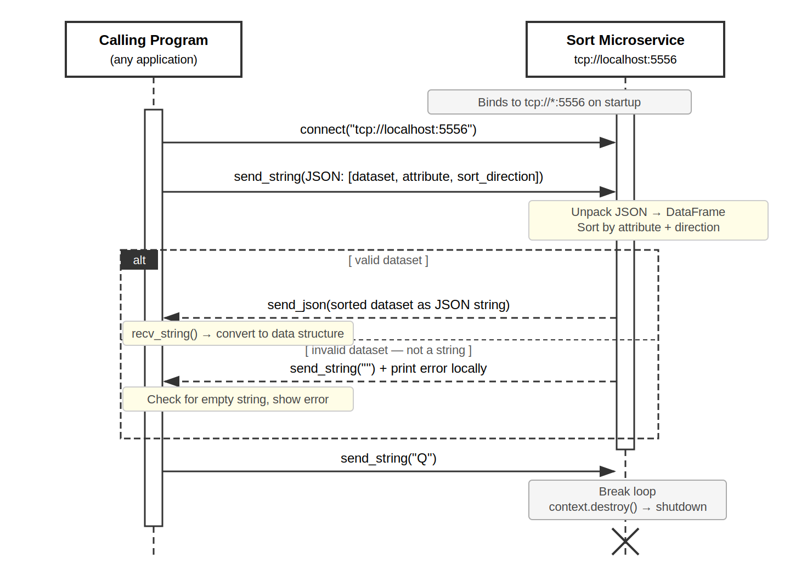

# Sorting microservice

## Function:
Takes a dataset in the format of a JSON list, converts to a pandas dataframe,
sorts by the user chosen attribute and/or sort direction. If no attribute
is specified by the user, then the dataset is sorted on column 1. If no sort
direction is specified by the user, then the dataset is sorted in ascending 
order by default. The microservice is called via a ZMQ Request - Response pipeline.  
The details of how to setup the ZMQ environment, make a request, and receive a reply  
can be found below.  

## How to Run:
 
1. Install dependencies for dev environment  
   pip install pyzmq  
   pip install pandas  
2. Import dependencies for main/calling/client application  
   import subprocess  
   import zmq  
   import json  
   import time  
   from io import StringIO  
3. Start up the sort microservice by running it as a separate process on main app startup using:
```python 
sort_process = subprocess.Popen(['python', 'sort_microservice.py'])
```
4. Use sleep so main app doesn't try connecting before microservice can be started
    time.sleep(1)
5. Quit signal when main program shuts down
    send 'Q' to the microservice to initiate cleanup

## Example Call/Request:  
socket is initialized and connects to sort microservice via port 5556.   
after payload is converted into json, the payload/request is sent via socket.send_string(request)

### Sort Direction Values
3 = ascending   
any other value = descending

### environment set up
```python
context = zmq.Context()
```
### create socket for sort microservice  
```python
sort_socket = context.socket(zmq.REQ)  
sort_socket.connect("tcp://localhost:5556")
```

### request
```python
request = json.dumps([dataframe, sort_attribute, sort_direction])  
sort_socket.send_string(request)
```  


# Example Receipt:

### receive response/sorted data
### calling/client program will wait until response is received. socket.recv_string() must be used to receive the response  
### for the client program to continue.  
```python
sorted_data = sort_socket.recv_string()
```

### IMPORTANT: response must be checked for empty string. Invalid datasets sent to the microservice will send back "" as a response.
check for invalid response  
```python
if sorted_data:  
    results = pd.read_json(StringIO(sorted_data))
else:
    print('-' * 60)
    print(" Error: Sort request could not be completed. Please try again. ")
    print('-' * 60)
```


## Other Notes
Sort_microservice.py runs as a separate process on port 5556 using a ZMQ REP socket.
It is launched automatically using the code above. Do not run sort_microservice.py manually. 

## UML Sequence Diagram

